# Polar Plotter
Ein Projekt der Hochschule Pforzheim.

- [Benötigte Komponenten](#benötigte-komponenten)<br>
  - [Zukaufteile](#zukaufteile)<br>
  - [3D-Druck Teile](#3d-druck-teile)<br>
- [Installation Polargraph Software](#installation-polargraph-software)<br>
- [Aufbau des Plotters](#aufbau-des-plotters)<br>
- [Einstellungen in der Software](#einstellungen-in-der-software)<br>

## Benötigte Komponenten

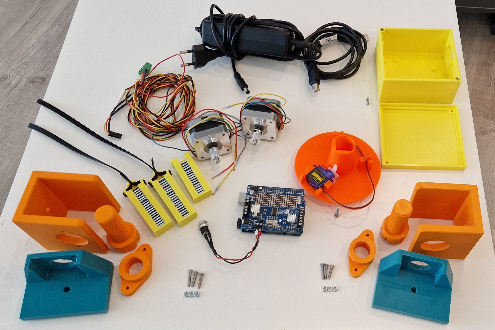

### Zukaufteile


- Arduino Uno: http://store.arduino.cc/products/arduino-uno-rev3

- Adafruit Motor Shiled v2: https://www.adafruit.com/product/1438

- Servomotor: https://www.amazon.de/dp/B07CYZK379?ref_=cm_sw_r_cp_ud_dp_AW2FQ5ZJ4909N2ZZ1QXP
  - 5 V
  - 22,2 x 11,8 x 31 mm

- Schrittmotoren: https://www.adafruit.com/product/324#technical-details
  - 200 steps per revolution
  - 1.8 degrees
  - 12 V
  - 350 mA

- Zahnriemen und Zahnräder aus 3D-Drucker Bereich: https://www.amazon.de/dp/B07QH94G71?ref_=cm_sw_r_cp_ud_dp_NBP2886NY2H1YNJAXYJZ
  - GT2 2 mm
  - Rastermaß 6 mm
  - 5 m Länge

- Gewichte: https://www.amazon.de/dp/B08F2H4TB8?ref_=cm_sw_r_cp_ud_dp_EE6H5DKYBR2R5X1NX4WT 
  - 100 g + 2 x 60 g

- 12 V Netzteil

- Schrauben und Muttern:
  - 3x Rutex Gewindebuchse M3x5.7: https://www.ruthex.de/products/ruthex-gewindeeinsatz-m3-100-stuck-rx-m3x5-7-messing-gewindebuchsen
  - 8x M3x10 Schraube
  - 4x M3x15 Schraube
  - 3x M3x18 Schraube
  - 1x M3x30 Schraube
  - 6x M3 Mutter
  - 6x M2x5 Schraube (spitz)

### 3D-Druck Teile

STL-Dateien aus `/bauteile` auf dem 3D-Drucker herstellen. Die Komponenten und deren Funktionsweise werden [hier](stl\README.md) erläutert.

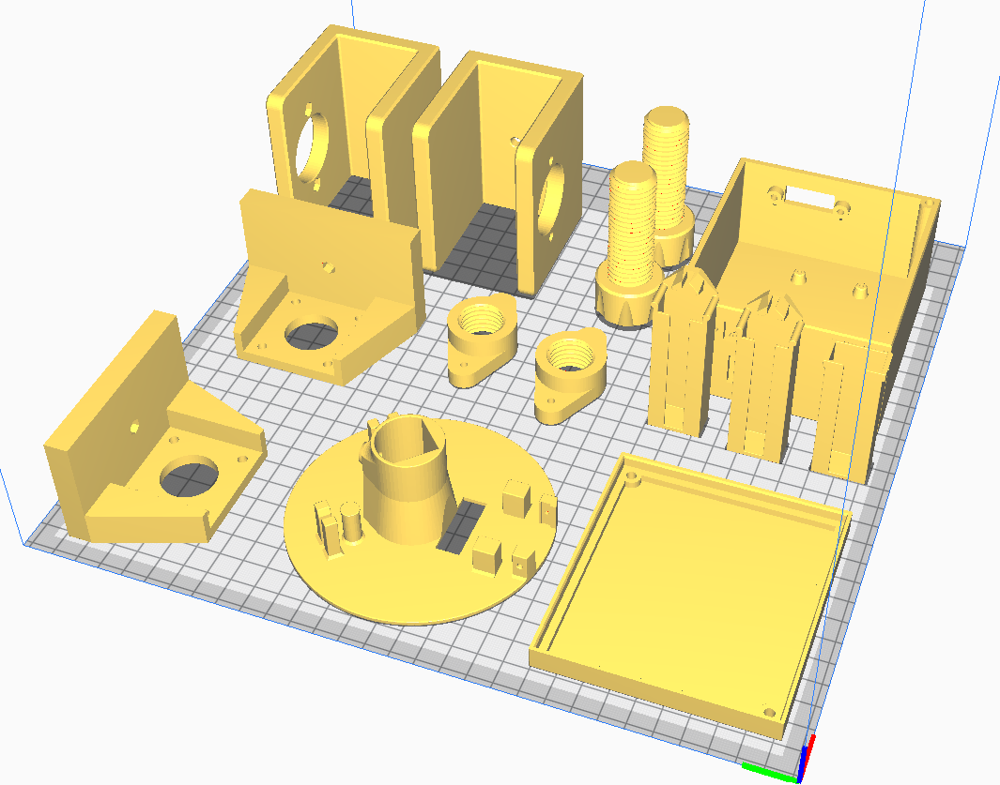


## Installation Polargraph Software

- Herunterladen und installieren von Arduino IDE v1.8.5: https://www.arduino.cc/en/software/OldSoftwareReleases#previous

- Herunterladen des Polargraphcontollers: https://github.com/euphy/polargraphcontroller/releases/tag/2017-11-01-20-30

- Dieses Verzeichnis (polargraph.2017-11-01.zip) entpacken und öffnen. Darin ist ein Ordner `\arduino-source\polargraph-server-a1` enthalten. Diesen in den Arduino Ordner verschieben (`C:\Users\"PCNAME"\Documents\Arduino`).

- Den Inhalt des Ordners `\arduino-source\libraries` in den Ordner `C:\Users\"PCNAME"\Documents\Arduino\libraries` verschieben. 
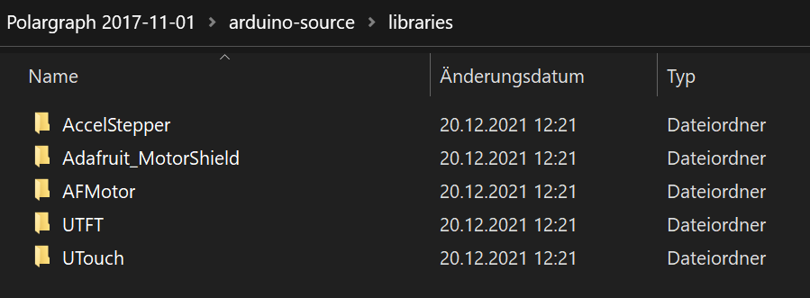

- Anschließend Arduino IDE starten.

- `File -> Sketchbook -> polargraph_server_a1` auswählen und im Tab polargraph_server_a1 unter 1. den Controller auf MC_UNO einstellen. Unter 3. die verwendeten Motortreiber auswählen.

  ```
  // 1. 
  //Uncomment the line for the kind of board you have.
  #ifndef MICROCONTROLLER
  #define MICROCONTROLLER MC_UNO
  //#define MICROCONTROLLER MC_MEGA
  #endif

  // 3. 
  //Specify what kind of motor driver you are using
  #define ADAFRUIT_MOTORSHIELD_V2
  #include <Wire.h>
  #include <Adafruit_MotorShield.h>
  #include "utility/Adafruit_PWMServoDriver.h"
  ```

- Auswahl des Boards: `Tools -> Board -> Arduino Uno`

- Setzen des angeschlossenen Ports: `Tools -> Port -> COMx`

- Auf den Pfeil klicken, um den Code auf den Arduino zu laden. Warten, bis Hochladen abgeschlossen ist.

- Herunterladen und installieren von Processing v2.2.1: https://processing.org/download?processing

- Processing starten und wieder schließen.

- Im bereits heruntergeladenen Verzeichnis (polargraph.2017-11-01) den Inhalt des Ordners `Polargraph.2017-11-01\processing-source\Processing libraries` nach `C:\Users\"PCNAME"\Documents\Processing\libraries` kopieren.
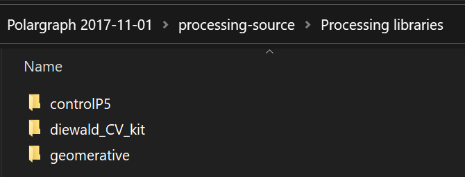

- Anschließend den gesamten Ordner `Polargraph 2017-11-01\processing-source\polargraphcontroller` in den Processing Sketchbook Ordner (`C:\Users\"PCNAME"\Documents\Processing`) kopieren.

- Processing erneut starten und `File -> Sketchbook -> polargraphcontroller` öffnen.

- Run drücken, um den Controller zu starten.

## Aufbau des Plotters

- Zusammenbau der beiden Motorhalterungen aus den 3D-Druckteilen, jeweils 3 Schrauben (2st M3x15, 1st M3x18) und 3 Muttern.

 
- Festschrauben der Motoren an der Halterung, Befestigung am Zeichenbrett und Anbringung der Zahnräder.
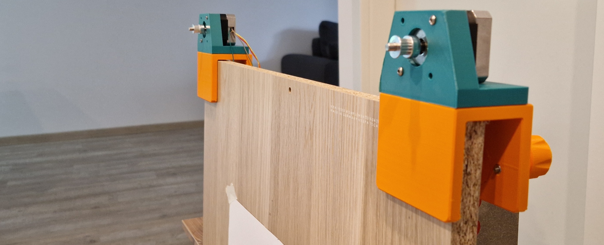

- Anbringen des Motorshields auf dem Arduino und löten der Pins. Anschließend vorbereiten der 12 V Stromversorgung.
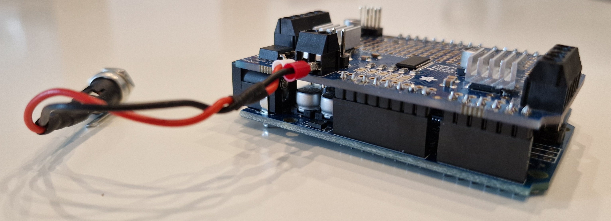

- Einlegen der Gewichte in die Halterungen und Befestigung des Gummiriemens durch Verkanten der Zähne. Riemen soll einmal gespiegelt angebracht werden (siehe Bild).
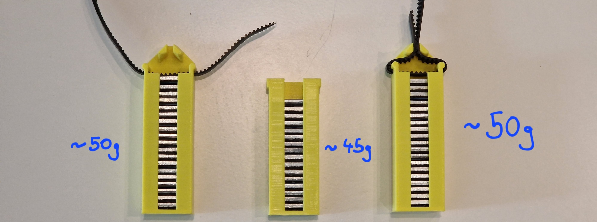

- Anbringen des Servomotors und der Gewichthalterung an der Gondel. Befestigung des Gummiriemens durch Verkanten. Verlängerungskabel für den Servomotor verbinden. Einschmelzen des Gewindes in die Bohrung.
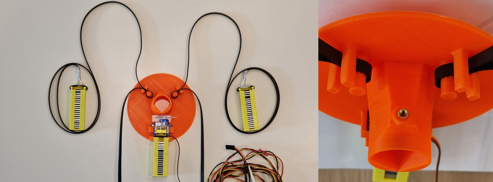


- Aufsetzen der Konstruktion über die Zahnräder und Kabel auf die Rückseite führen.


- Verkabelung der beiden Schrittmotoren an die Klemmen (Blau/Grün ein Coil, Gelb/Rot ein Coil) und aufstecken des Servosteckers an die Servo 2 Pins. Herstellen der 12 V Stromversorgung und der USB-Verbindung mit einem Windows-PC.


- Anbringung eines Zeichenblattes auf dem Zeichenbrett.

- Zum Schluss kann der Arduino in das gedruckte Gehäuse gesetzt und verschraubt werden.

## Einstellungen in der Software

### SETUP

Einstellungen für die Abmessungen des Zeichenbretts und des Zeichenblatts sowie weitere grundsätzliche Einstellungen. Im Tab SETUP.

| Feldname | Wert | Bedeutung |
|---|----:|----------------|
| MM PER REV        | 64 | Drehung des Riemens pro Schritt |
| STEPS PER REV     | 1090 | Schritte pro Umdrehung (alt. 400) |
| STEP MULTIPLIER   | 6 | Skalierung der Schritte (alt. 16)|
| MASCHINE WIDTH    | - | Breite des Zeichenbretts (Distanz zwischen Innenseite der Zahnräder)               |
| MASCHINE HIGHT    | - | Höhe des Zeichenbretts |
| PAGE WIDTH        | - | Breite des Zeichenblatts |
| PAGE HIGHT        | - | Höhe des Zeichenblatts |
| PAGE POS X        | - | X-Position des Blatts |
| PAGE POS Y        | - | Y-Position des Blatts |
| HOME POS X        | - | X-Position des Homepunkts |
| HOME POS Y        | - | Y-Position des Homepunkts |
| PEN UP POSTION    | - | Winkel des Servos für angehobenen Stift |
| PEN DOWN POSITION | - | Winkel des Servos für abgesetzten Stift |
| MOTOR MAX SPEED | 1000 | Maximalgeschwindigkeit des Motors |
| MOTOR MAX ACCELERATION | 400 | Maximalbeschleunigung des Motors |

- Außerdem muss der `SERIAL PORT...` eingestellt werden. Ist die Verbindung erfolgreich, erscheint in grün `Polargraph READY! (Uno)`

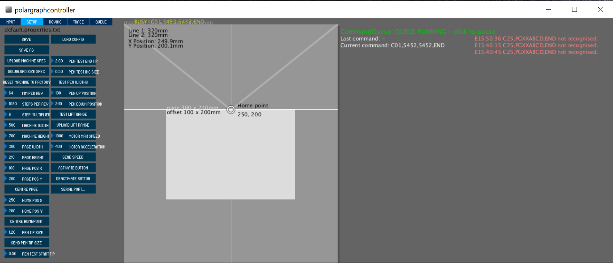


### INPUT

Einstellungen, die das Zeichenobjekt betreffen. Über Tab INPUT.

- Zuerst muss die Gondel manuell so eingehängt werden, dass sich der Stift direkt über dem Homepunkt befindet. Anschließend kann über den Button `SET HOME` dieser Punkt abgespeichert werden.

- Durch Klicken auf den Button `LOAD IMAGE FILE` kann eine Bilddatei ausgewählt und auf dem Brett positioniert werden. Über `RESIZE IMAGE` und `MOVE IMAGE` kann die Größe und Position noch verändert werden.

- Es gibt die Möglichkeit ein Bild schattiert zu zeichnen, dafür `INPUT -> RENDER PIXELS`. Alternativ kann die Kontur eines Vektors oder Bilds gezeichnet werden, dafür `TRACE -> CAPUTER`, anschließend `DRAW CAPTURE` um den Code zu generieren.

- Durch klicken auf `QUEUE PAUSED` wird der gesendete Code ausgeführt.

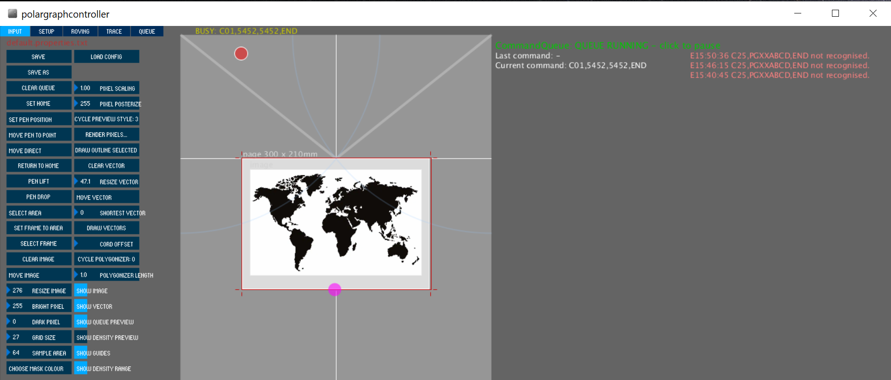

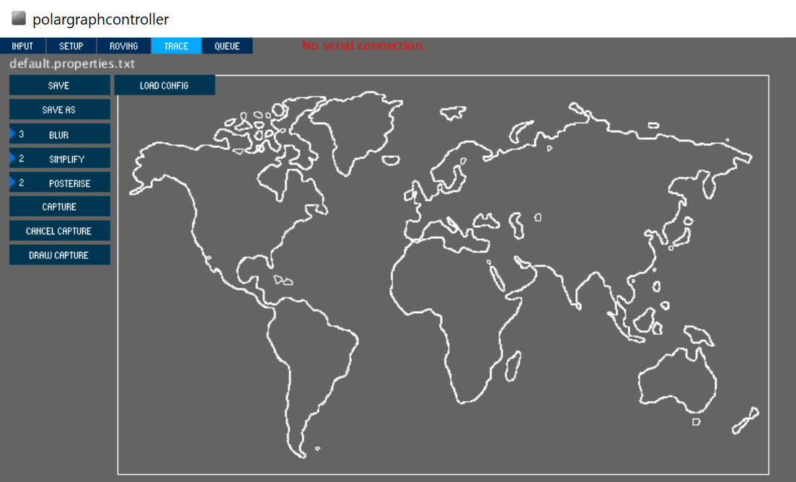


